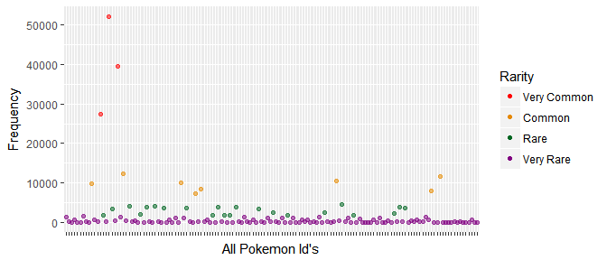
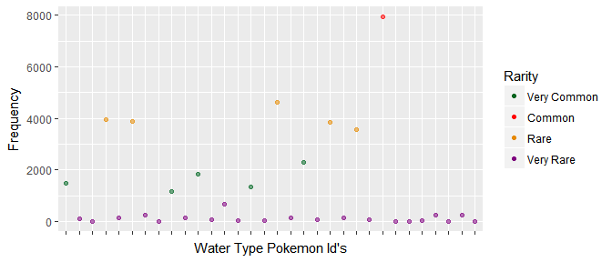
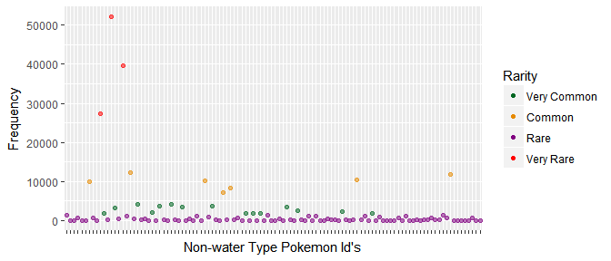

PokémonGo Machine Learning Report
================
Hunter Campbell
June 20, 2017

<br>

### **The Question**

The machine learning question for *PokémonGo* is: **How to calculate Pokémon rarity**.

If Pokémon rarity can be calculated, then a *PokémonGo* user would know what Pokémon are truly rare (and worth searching for), and which are common. That's what will be solved in this report.

<br>

### **The Machine Learning Technique**

A supervised approach was used to solve Pokémon rarity. To be specific, the K-means algorithm was used on the independent variable of Pokémon Id. This way, rarity could be clustered into a few different groups. Four groups were chosen: Common, Uncommon, Rare, and Very Rare. So, four clusters were made. First, the data had to be set-up to be able to make these clusters.

Here's the code for the set-up:

``` r
#First I made new datasets:
cleanId <- select(PokeGo_clean, pokemonId)
waterId <- select(PokeGo_water2water, pokemonId)
notwaterId <- select(PokeGo_notwater2water, pokemonId)

#I turned them into a factor, because each Id represents a Pokemon.
cleanIdFactor <- as.factor(cleanId$pokemonId)
waterIdFactor <- as.factor(waterId$pokemonId)
notwaterIdFactor <- as.factor(notwaterId$pokemonId)

#I then counted the number of times each Pokemon is seen:
cleanId <- count(cleanIdFactor, 1)
waterId <- count(waterIdFactor, 1)
notwaterId <- count(notwaterIdFactor, 1)

#and arranged the datasets by the frequency (this way k-means will group it
#according to the rarity/frequency instead of the Id).
cleanId <- arrange(cleanId, freq)
waterId <- arrange(waterId, freq)
notwaterId <- arrange(notwaterId, freq)
#I then changed the x columns name back to PokemonId, because count deleted the 
#old PokemonId column and replaced it with a column named x.
colnames(cleanId)[1] <- "pokemonId"
colnames(waterId)[1] <- "pokemonId"
colnames(notwaterId)[1] <- "pokemonId"
```

Now that the code is set-up for K-means Clustering, the clusters can be made.

Here's the code:

``` r
k <- 4
set.seed(1)

#Making the clusters for each dataset:
cleanIdKMC <- kmeans(cleanId$freq, centers = k)
waterIdKMC <- kmeans(waterId$freq, centers = k)
notwaterIdKMC <- kmeans(notwaterId$freq, centers = k)
```

<br>

### **The Results**

Now that each dataset has been clustered, it can now be evaluated to show the results.

**All Pokémon**



<br>

**Water Type Pokémon**



<br>

**Non-water Type Pokémon**



<br>

### **Conclusion**

As each graph demonstrates, the K-means Algorithm calculated rarity under each case. It even calculated the rarity of water type Pokémon; which means it can calculate any specific Pokémon type, or even a group of Pokémon (like the non-water type graph). In this way, any *PokémonGo* user can know which Pokémon are rare, and which are common.

<br>
