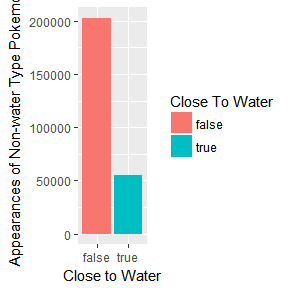
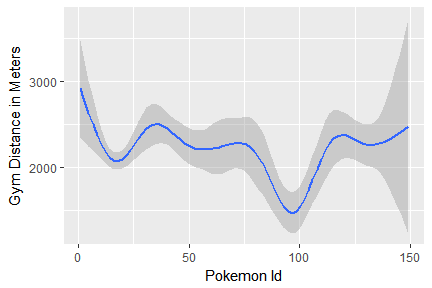

PokémonGo Statistical Report
================
Hunter Campbell
June 16, 2017

 

The findings from the PokeémonGo statistical calculations are quite interesting. In this report I'll show you my findings and the correlation between Pokémon spawn frequency and different environments that a PokémonGo user might encounter. We'll see a rise in rare Pokémon spawn rates and a drop in common Pokémon spawn rates, all based on location. We'll also see PokémonGo users' preferred circumstances to play *PokémonGo* and how it affects Pokémon spawn rates. Lets get started!

 

##### **PokémonGo Rarity Chart**

To start us off we need to know the difference between which Pokémon are common, and which are more rare. The rarity in PokémonGo is different than the older *Gameboy* to *DS* games. In PokémonGo, the rarity is based on how often a Pokémon spawns. As the graph shows, there is a peek of Pokémon Id's from 10-25. There are also a few shorter peeks around 40-50, 95-100, and 130-135.

If you need a reference on what each Pokémon Id is, go here: [Pokémon Id's](https://bulbapedia.bulbagarden.net/wiki/List_of_Pok%C3%A9mon_by_Kanto_Pok%C3%A9dex_number)

 

##### **PokémonGo Users' Preferred Circumstances**

These four graphs show different PokémonGo Users' Preferences of Circumstances. The first graph shows what day of the week PokémonGo Users prefer to play. The most popular days are Wednesday through Saturday, with the peek being Friday and Saturday. The second graph shows what time PokémonGo users prefer to play. Night time is, interestingly, the most popular time to play, while the other times of day are around the same height. The third graph shows the preferred weather that PokémonGo users play during. As expected, they play most often during nice weather. The fourth graph shows the type of terrain most PokémonGo users play in. This most likely is just the terrain type of where they live, but that also means that there is a common ground of what terrain PokémonGo users play in.

Here's a reference for what each number equals for each terrain: [Terrain Types](http://glcf.umd.edu/data/lc/)

 

##### **Pokémon Spawn Frequency Correlations**

These first three graphs show the correlation of Pokémon near water. The first graph is the control for the other two graphs, because it contains every Pokémon. The next graph shows the correlation between water type Pokémon near water, and the graph after that shows the correlation between non-water type Pokémon near water. There is a definite higher probability of finding a water type Pokémon near water vs. a non-water type Pokémon near water. In fact, there is about a 16% higher probability of seeing a water type Pokémon near water!

 

The two graphs below show how population density affects Pokémon spawn rates. The first is a density plot. It makes sense that our density is mostly around the mean of 1,313.6. It also shows similar peeks to the Pokémon Id graph. The second graph is a visualization of the rarity of Pokémon in a densely populated area. It's interesting that the peeks and valleys are quite opposite to the Pokémon Id graph, except at the end, where there is a constant decline. This shows that a PokémonGo user has a higher chance of seeing rare Pokémon while in densly populated areas.

 

These next two graphs show how being near a gym affects the rarity of Pokémon. The first graph shows that there is a higher density of Pokémon near gyms, because the closer you are to zero on the y-axis, the closer you are to a gym. The second graph then shows that there is a rise in seeing rare Pokémon near gyms, and a decline of common Pokémon near gyms. Being by a gym would lead to greater success finding rare Pokémon.

 

These last two graphs show the same thing as the gym graphs, but instead shows the affect on rare Pokémon near a pokéstop. Again, the first graph, shows that there is a rise in Pokémon density the closer you are to a pokéstop. Being near a pokéstop is more demanding than being near a gym, though. Interestingly, the second graph shows a large incline to rare Pokémon with Id's between 125-150. This shows similar results to the gym graphs, which means that there is a higher chance of finding rare Pokémon near pokéstops!

 

Here's a comparison of the three line graphs, showing Pokémon rarity, next to the Pokémon Id graph:

 

To wrap everything up, the graphs clearly show a relationship between Pokémon in PokémonGo and the environment in which the user is playing. We see that there is a higher chance of seeing a water type Pokémon near water, and a higher chance of seeing rare Pokémon in densly populated areas, near gyms, and near pokéstops.
