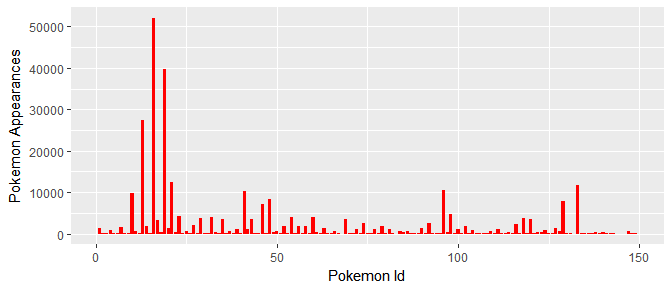
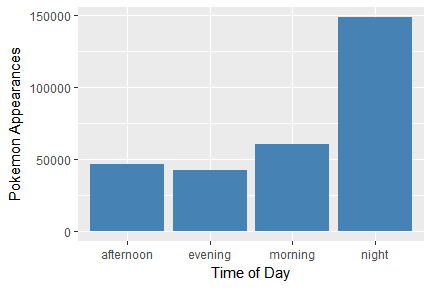
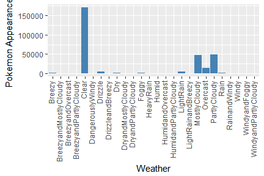
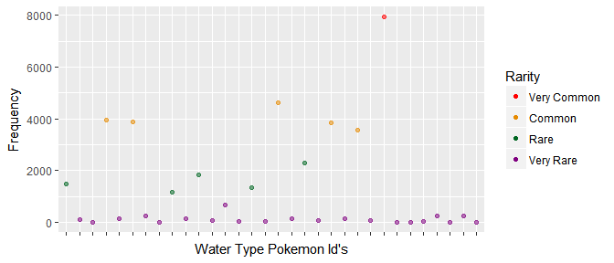
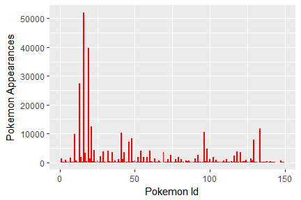
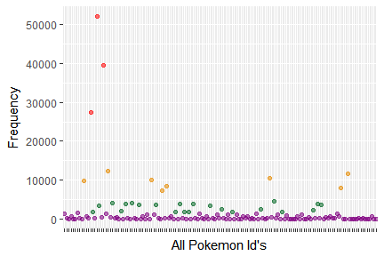
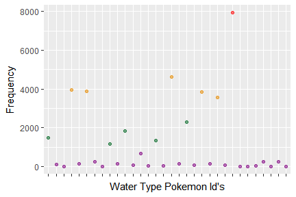

PokémonGo Capstone Project
================
Hunter Campbell
June 16, 2017

<br>

### **Introduction**

*PokémonGo* is an augmented reality game for handheld devices created by *Niantic, Inc.* With over 100 million downloads, *PokémonGo* is one of the most popular apps ever created. This report shows the correlation between Pokémon spawn frequency and different environments that a *PokémonGo* user might encounter. This report also presents data and graphical analysis that will affirm a rise in rare Pokémon spawn rates and a drop in common Pokémon spawn rates--- all based on location. At the end of the report, rarity will be calculated so that *PokémonGo* users may know which Pokémon are truly rare, and which are not. This report ultimately can help all *PokémonGo* users with their quest to "Catch'em All". Lets get started!

<br>

### **The Data Wrangling**

The original data is too big to upload to github, so here is a link to download the data: [Original PokémonGo Data](https://www.kaggle.com/semioniy/predictemall)

There were several columns from the original data that didn't make sense to include in this report. This shows the columns that were picked and how they were written in *RStudio*:

``` r
PokeGo_clean <- select(PokeGo_original, pokemonId, appearedTimeOfDay,
                       appearedDayOfWeek, terrainType:closeToWater,
                       weather, population_density,
                       gymDistanceKm, pokestopDistanceKm)
```

The new data (clean) was then ordered according to our independent variable (Pokemon Id):

``` r
library("dplyr")
PokeGo_clean <- PokeGo_clean %>% arrange(pokemonId)
```

Afterwards, any blank and/or NA values were checked for (both returned as zero):

``` r
sum(is.na(PokeGo_clean))
sum(PokeGo_clean == "")
```

In the Day of Week column, Monday wasn't found, but there was a variable listed as "dummy\_variable". The dummy variable was then changed to Monday:

``` r
PokeGo_clean$appearedDayOfWeek <- gsub("dummy_day", "Monday", PokeGo_clean$appearedDayOfWeek, ignore.case = T)
```

The gym and pokéstop distance columns were originally labelled as kilometers, which was hard to read, because of the decimal placement. They were both changed to read as meters:

``` r
PokeGo_clean$gymDistanceKm <- PokeGo_clean$gymDistanceKm * 1000
PokeGo_clean$pokestopDistanceKm <- as.numeric(PokeGo_clean$pokestopDistanceKm) * 1000
#NA's were created in the pokestop distance column, here's the fix (replaced with the mean of the column):
PokeGo_clean$pokestopDistanceKm[is.na(PokeGo_clean$pokestopDistanceKm)] <- mean(PokeGo_clean$pokestopDistanceKm, na.rm = T)

#Changing the titles of the two columns:
colnames(PokeGo_clean)[8] <- "gymDistance_m"
colnames(PokeGo_clean)[9] <- "pokestopDistance_m"
```

After creating the clean data, two new datasets were created to later test the correlation of Pokémon to Close to Water. This is how they were made:

``` r
#The water type Pokemon dataset:
PokeGo_water2water <- filter(PokeGo_clean, pokemonId ==
                               c(7:9, 54:55, 60:62, 72:73, 79:80,
                                 86:87, 90:91, 98:99, 116:121,
                                 129:131, 134, 138:141)) %>%
    select(pokemonId, closeToWater)

#The non-water type Pokemon dataset:
PokeGo_notwater2water <- filter(PokeGo_clean, pokemonId ==
                                  c(1:6, 10:53, 56:59, 63:71, 74:78,
                                    81:85, 88:89, 92:97, 100:115,
                                    122:128, 132:133, 135:137, 142:151)) %>%
    select(pokemonId, closeToWater)
```

<br>

### **The Data**

These are the top few rows of the data that will be used (which was made in the Data Wrangling section):

**The Clean Data**

    ##   pokemonId appearedTimeOfDay appearedDayOfWeek terrainType closeToWater
    ## 1         1             night            Monday           4        false
    ## 2         1             night            Monday           1        false
    ## 3         1             night            Monday          14        false
    ## 4         1             night            Monday          10        false
    ## 5         1             night            Monday          13        false
    ## 6         1             night            Monday          12        false
    ##        weather population_density gymDistance_m pokestopDistance_m
    ## 1        Clear           89.69245       129.686             64.508
    ## 2 PartlyCloudy          849.44226       857.628            597.432
    ## 3        Foggy         2431.23410       162.035             20.960
    ## 4        Clear           69.58565      1429.557            541.424
    ## 5 MostlyCloudy         2102.97750       162.300             30.897
    ## 6        Foggy          178.63580        46.312            142.046

**Summary of the Clean Data**

``` r
summary(PokeGo_clean)
```

    ##    pokemonId      appearedTimeOfDay  appearedDayOfWeek  terrainType   
    ##  Min.   :  1.00   afternoon: 45958   Friday   :68037   Min.   : 0.00  
    ##  1st Qu.: 16.00   evening  : 42183   Monday   : 9001   1st Qu.: 8.00  
    ##  Median : 21.00   morning  : 59890   Saturday :72201   Median :13.00  
    ##  Mean   : 45.32   night    :147990   Sunday   :32056   Mean   :10.54  
    ##  3rd Qu.: 69.00                      Thursday :54257   3rd Qu.:13.00  
    ##  Max.   :149.00                      Tuesday  :  354   Max.   :16.00  
    ##                                      Wednesday:60115                  
    ##  closeToWater           weather       population_density gymDistance_m    
    ##  false:227522   Clear       :170482   Min.   :    0.0    Min.   :      1  
    ##  true : 68499   PartlyCloudy: 48349   1st Qu.:  160.2    1st Qu.:    183  
    ##                 MostlyCloudy: 46589   Median :  570.0    Median :    334  
    ##                 Overcast    : 14419   Mean   : 1313.6    Mean   :   2149  
    ##                 LightRain   :  4488   3rd Qu.: 1691.8    3rd Qu.:    636  
    ##                 Drizzle     :  4237   Max.   :10000.0    Max.   :3859425  
    ##                 (Other)     :  7457                                       
    ##  pokestopDistance_m
    ##  Min.   :     0.2  
    ##  1st Qu.:    66.4  
    ##  Median :   156.3  
    ##  Mean   :   695.8  
    ##  3rd Qu.:   367.2  
    ##  Max.   :455961.1  
    ## 

**Example of Standard Deviation of the Clean Data**

``` r
#For population density:
sd(PokeGo_clean$population_density)
```

    ## [1] 1913.71

``` r
#For gym distance:
sd(PokeGo_clean$gymDistance_m)
```

    ## [1] 18646.15

``` r
#For pokestop distance:
sd(PokeGo_clean$pokestopDistance_m)
```

    ## [1] 6855.401

<br>

**Water Type Pokémon Data**

    ##   pokemonId closeToWater
    ## 1         7        false
    ## 2         7         true
    ## 3         7         true
    ## 4         7        false
    ## 5         7        false
    ## 6         7        false

<br>

**Non-water Type Pokémon Data**

    ##   pokemonId closeToWater
    ## 1         1        false
    ## 2         1        false
    ## 3         1        false
    ## 4         1        false
    ## 5         1        false
    ## 6         1        false

The summary for water and non-water, will be stated below when testing for their correlation to Pokémon Id.

<br>

### ***PokémonGo* Rarity Chart**

To start us off, we need to know the difference between the Pokémon that are common, and the Pokémon that are more rare. The rarity in *PokémonGo* is different than the older *Gameboy* to *DS* games. In *PokémonGo*, the rarity is based on how often a Pokémon spawns. As the graph below shows, there is a peak of Pokémon Id's from 10-25 (the common Pokémon). There are also a few shorter peaks around 40-50, 95-100, and 130-135 (the less common Pokémon). The rest of the graph shows the rare Pokémon. This graph is essentially showing the independent variable (Pokémon Id), because everything else in the dataset depends on Pokémon Id.

Here's a reference on what each Pokémon Id is: [Pokémon Id's](https://bulbapedia.bulbagarden.net/wiki/List_of_Pok%C3%A9mon_by_Kanto_Pok%C3%A9dex_number)



<br>

### **Pokémon's Preferred Circumstances**

These four graphs show different Pokémon's preferred circumstances to spawn during.

The first graph shows what days of the week Pokémon usually spawn. The most popular days are Wednesday through Saturday, with the peak being Friday and Saturday.

The second graph shows what time Pokémon most often spawn during. Night time is, interestingly, the most popular time to spawn, while the other times of day are around the same height.

The third graph shows the preferred weather that Pokémon spawn during.

The fourth graph shows the type of terrain most Pokémon spawn in. This most likely is just the terrain type of where users live, but that would also mean that there is a common ground for what terrain Pokémon spawn.

We can assume from the graphs that there is a correlation between when and where Pokémon spawn and a *PokémonGo* user's activity with the app. This would mean that *PokémonGo* users usually play on the weekend, during good weather, in a common location, and/or during the night. These graphs do not present anything further than this concerning the why (e.g. Why during the night?) for each of these items.

Here's a reference for what each number equals for each terrain: [Terrain Types](http://glcf.umd.edu/data/lc/)



<br>

### **Pokémon Spawn Frequency Correlations**

**Pokémon to Close to Water**

The first graph is the control for the other two graphs, because it contains every Pokémon.

The second graph shows the correlation between water type Pokémon near water, and the graph after that shows the correlation between non-water type Pokémon near water. Be mindful of the numbers on the y-axis, because this makes a difference in how our graphs are analyzed.


There is a definite higher probability of finding a water type Pokémon near water vs. a non-water type Pokémon near water. Lets calculate this:

``` r
summary(PokeGo_water2water$closeToWater)
```

    ## false  true 
    ## 24507 13901

``` r
#To find the percentage:
13901/(24507+13901)
```

    ## [1] 0.3619298

This returns about a 36.2% chance of seeing a water type Pokémon near water. Now lets calculate the chance of seeing a non-water type Pokémon near water:

``` r
summary(PokeGo_notwater2water$closeToWater)
```

    ##  false   true 
    ## 203015  54598

``` r
#To find the percentage:
54598/(203015+54598)
```

    ## [1] 0.2119381

This returns about a 21.2% chance of seeing a non-water type Pokémon near water. That's a 15% difference! There is a 15% higher probability of finding a water type Pokémon near water.

<br>

**Pokémon to Population Density**

The first is a density plot. It makes sense that our density is mostly around the mean of 1,313.6. This code line shows the mean of population density:

``` r
summary(PokeGo_clean$population_density)
```

    ##    Min. 1st Qu.  Median    Mean 3rd Qu.    Max. 
    ##     0.0   160.2   570.0  1313.6  1691.8 10000.0

The first graph also shows similar peaks to the Pokémon Id graph. (This will be compared towards the end of the Pokémon Spawn Frequency Correlations section.)

The second graph is a visualization of the rarity of Pokémon in a densely populated area. It's interesting that the peaks and valleys are quite opposite to the Pokémon Id graph, except at the end, where there is a constant decline. This shows that a *PokémonGo* user has a higher chance of seeing rare Pokémon while in densly populated areas.


<br>

**Pokémon to Gym Distance**

The first graph demonstrates that there is a higher density of Pokémon near gyms, because the closer the graph approaches zero on the y-axis, the closer a *PokémonGo* user is to a gym.

The second graph then shows that there is a rise in seeing rare Pokémon near gyms and a decline of common Pokémon near gyms. Being by a gym would lead to greater success finding rare Pokémon. There is some error ribbons to be noted, with great error around the Pokémon Id's of 130-150, but the line of best fit shows great results.


<br>

**Pokémon to Pokéstop Distance**

Again, the first graph shows that there is a rise in Pokémon spawn rates the closer a *PokémonGo* user is to a pokéstop. Being near a pokéstop is more demanding than being near a gym, though, because the density plots don't reach quite as high as the gym density plot.

Interestingly, the second graph shows a steady incline for rare Pokémon with Id's between 125-150. This shows similar results to the second gym graph, which means that there is a higher chance of finding rare Pokémon near pokéstops! Again, the error ribbons need to be noted, with greater error around the Pokémon Id's of 130-150. Also, the numbers on the y-axis for this graph are much lower than the gym graph, which again clarifies that pokéstops are much more demanding on how close a *PokémonGo* user needs to be to the pokéstop to see results.


<br>

**Pokémon Id to Pokémon Rarity**

Here's a comparison of the three line graphs, showing Pokémon rarity, next to the Pokémon Id graph:


<br>

### **Machine Learning**

To go above and beyond a visual estimate of rarity, rarity can be calculated and then plotted again. In this way, any *PokémonGo* user can have confidence between the difference of rare and common Pokémon. In this way, all of the information above can be applied on a more successful scale.

A supervised approach was used to solve Pokémon rarity. To be specific, the K-means algorithm was used on the independent variable of Pokémon Id. This way, rarity could be clustered into a few different groups. Four groups were chosen: Very Common, Common, Rare, and Very Rare. So, four clusters were made. That is how K (which equals 4) was chosen. First, the data had to be set-up to be able to make these clusters.

Here's the code for the set-up:

``` r
#First I made new datasets:
cleanId <- select(PokeGo_clean, pokemonId)
waterId <- select(PokeGo_water2water, pokemonId)
notwaterId <- select(PokeGo_notwater2water, pokemonId)

#I turned them into a factor, because each Id represents a Pokemon.
cleanIdFactor <- as.factor(cleanId$pokemonId)
waterIdFactor <- as.factor(waterId$pokemonId)
notwaterIdFactor <- as.factor(notwaterId$pokemonId)

#I then counted the number of times each Pokemon is seen:
cleanId <- count(cleanIdFactor, 1)
waterId <- count(waterIdFactor, 1)
notwaterId <- count(notwaterIdFactor, 1)

#and arranged the datasets by the frequency (this way k-means will group it
#according to the rarity/frequency instead of the Id).
cleanId <- arrange(cleanId, freq)
waterId <- arrange(waterId, freq)
notwaterId <- arrange(notwaterId, freq)
#I then changed the x columns name back to PokemonId, because count deleted the 
#old PokemonId column and replaced it with a column named x.
colnames(cleanId)[1] <- "pokemonId"
colnames(waterId)[1] <- "pokemonId"
colnames(notwaterId)[1] <- "pokemonId"
```

Now that the code is set-up for K-means Clustering, the clusters can be made.

Here's the code:

``` r
#Here's our K variable:
k <- 4
set.seed(1)

#Making the clusters for each dataset:
cleanIdKMC <- kmeans(cleanId$freq, centers = k)
waterIdKMC <- kmeans(waterId$freq, centers = k)
notwaterIdKMC <- kmeans(notwaterId$freq, centers = k)
```

<br>

### **The Results of Machine Learning**

Now that each dataset has been clustered, it can now be evaluated to show the results.

**All Pokémon**


<br>

**Water Type Pokémon**



The y-axis needs to be noted with this graph. Because there is a smaller amount of water type Pokémon compared to all Pokémon, the y-axis numbers will be less than the all Pokémon types graph. Though, rarity is still calculated, specifically for water type Pokémon, if compared with the all Pokémon graph, the very common water type Pokémon is just barely reaching the common cluster of the all Pokémon graph and the common cluster of the water type Pokémon graph is hovering about the same height as the rare cluster in the all Pokémon graph. Even still, this graph is still acurately calculating rarity, but for water type Pokémon only. So, if a *PokémonGo* user is on the hunt for rare water type Pokémon, this graph will be a good tool to help with a rare Pokémon search.

<br>

**Non-water Type Pokémon**


<br>

**Comparison of Pokémon Id to Machine Learning Pokémon Rarity**



As each graph demonstrates, the K-means Algorithm calculated rarity under each case. It even calculated the rarity of water type Pokémon; which means it can calculate any specific Pokémon type, or even a group of Pokémon (like the non-water type graph) with great accuracy. In this way, any *PokémonGo* user can know which Pokémon are rare, and which are common.

<br>

### **In Conlusion**

To wrap everything up, the graphs clearly show a relationship between Pokémon in *PokémonGo* and the environments in which they spawn most often. There is a higher chance of seeing a water type Pokémon near water, and a higher chance of seeing rare Pokémon in densly populated areas, near gyms, and near pokéstops. This can be useful to any *PokémonGo* user, especially if they are on the hunt for rare Pokémon.

<br>

### **Ideas for Furthur Research**

1.  Analyze Pokémon type to terrain type and their perspective, compared probabilites.

2.  Calculate rarity for different Pokémon types.

<br>

### **Recommendations**

1.  While searching for rare Pokémon, search near a gym and/or a pokéstop.

2.  While searching for water type Pokémon, search near water.

3.  While searching for any type and/or rarity of Pokémon, search in urban areas (Terrain Type: 13), during good weather, during the weekend, and/or during night time.

<br>
